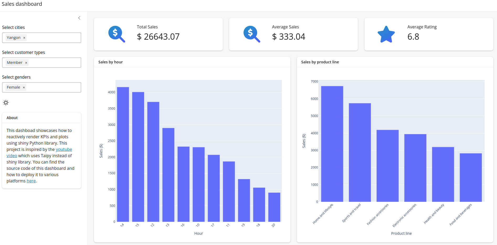

# shiny-sales-dashboard
An interactive dashboard built using shiny Python library. Check out the deployed version of the app [here](https://rasheed-ibraheem.shinyapps.io/sales-dashboard/).



## To run the app locally
1. Clone the repository by running
    ```
    git clone https://github.com/Rasheed19/shiny-sales-dashboard.git
    ```
1. Navigate to the root folder, i.e., `shiny-sales-dashboard` and create a python virtual environment by running
    ```
    python3 -m venv .venv
    source .venv/bin/activate
    ``` 
1. Prepare all modules by running
    ```
    pip install -r requirements.txt
    ```
1. Run the app
   ```
    shiny run app.py
    ```
    and stop the app by  `ctrl + C`.

## Deployment
You can deploy this app by to shiny cloud by following the steps highlighted [here](https://shiny.posit.co/py/docs/deploy-cloud.html). Alternatively you can deploy to Heroku by following steps in this [link](https://github.com/analythium/shiny-load-balancing/blob/main/01-heroku.md). If you prefere this, heroku configuration file `heroku.yml` and dockerfile `Dockerfile` have been provided.
